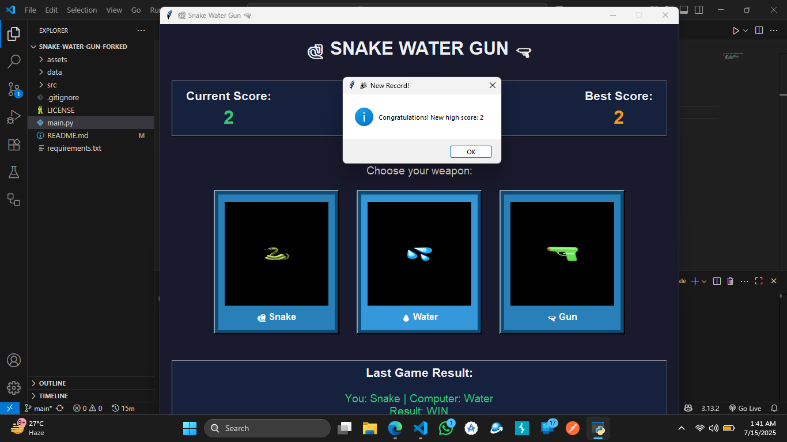

# 🐍 Snake Water Gun Game

A modern take on the classic Snake-Water-Gun game (like Rock-Paper-Scissors, but more fun). Built with Python and Tkinter, this desktop game features a responsive UI, real-time score tracking, animated buttons, and persistent history.

---

## 🚀 Features

* 🖼️ **Modern Tkinter UI** — Clean layout, theming, and button animations
* 📈 **Score Tracking** — Tracks your current and top scores
* 💾 **Persistent Data** — Saves top score and game history in JSON/CSV
* 📜 **Game History** — View scrollable history of previous rounds
* 🔁 **Reset Options** — Reset score and clear history
* 🧠 **Game Logic** — Snake drinks Water, Water ruins Gun, Gun kills Snake
* 🛡️ **Crash-Proof** — Handles missing files and bad inputs like a pro

---

## 📁 Directory Structure

```
snake-water-gun/
├── main.py
├── assets/
│   ├── snake.png
│   ├── water.png
│   ├── gun.png
│   └── help.png
├── data/
│   ├── top_score.json
│   └── history.csv
├── src/
│   ├── ui.py
│   ├── utils.py
│   ├── constants.py
│   └── game_logic.py
└── README.md
```

---

## 🧠 Rules

* 🐍 Snake drinks 💧 Water → Snake wins
* 💧 Water ruins 🔫 Gun → Water wins
* 🔫 Gun kills 🐍 Snake → Gun wins

Same choices? It's a **tie**.

---

## ▶️ How to Run

```bash
# Make sure you have required packages
pip install pillow

# Run the game
python main.py
```

---

## 🔧 Tech Stack

* **Python 3.x**
* **Tkinter** — UI toolkit
* **Pillow** — For image handling

---

## 📌 To-Do (Open for Contributions)

* 🎯 Add sound effects
* 🌐 Add multiplayer or online mode
* 🏅 Achievements / badges system
* 📊 Stats dashboard
* 🌈 Dark/light mode toggle

---

## 🤝 Contributing

1. Fork this repo
2. Make your changes in a new branch
3. Push and open a pull request

---

## 📜 License

MIT License. Do whatever, just don’t sue me when Snake beats Gun and you lose your high score.

---

## 👀 Screenshot

